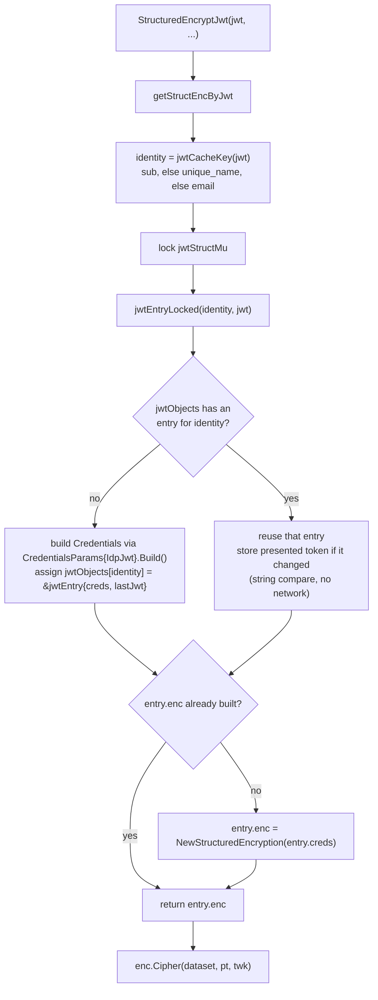
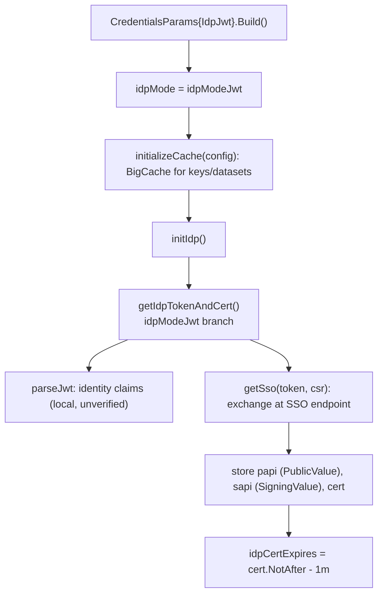
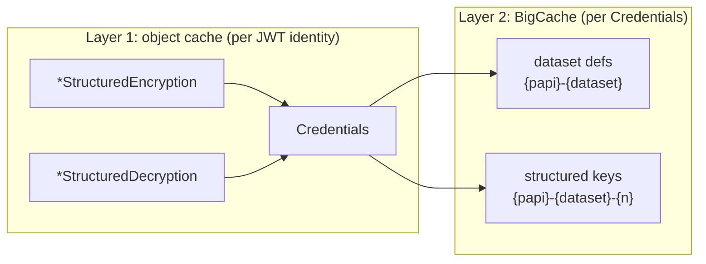

# JWT IDP Caching and Token Lifecycle

How the JWT-based structured API (`StructuredEncryptJwt`, `StructuredDecryptJwt`, and the related `*Jwt` functions) caches credentials and keys, and how a cached identity stays valid over time (token refresh, cert renewal, event tracking).

Source: [structured_jwt.go](../structured_jwt.go), [cache.go](../cache.go), [credentials.go](../credentials.go).

## Two cache layers

1. **Object cache** (JWT-specific): one process-wide map in `structured_jwt.go`. It maps a JWT identity to an entry holding its `Credentials`, `*StructuredEncryption`, and `*StructuredDecryption`. Built once per identity, reused for the life of the process.
2. **Key/dataset cache** (BigCache): each `Credentials` owns a BigCache (`cache.go`) holding dataset definitions and FF1 keys. The enc and dec objects for one identity are built from the same `Credentials`, so they share this cache.

## Layer 1: object cache

All state is one map behind one mutex ([structured_jwt.go:20](../structured_jwt.go#L20)):

```go
var (
    jwtStructMu sync.Mutex
    jwtObjects  = map[string]*jwtEntry{}
)

type jwtEntry struct {
    creds   Credentials
    lastJwt string                // most recently presented raw token
    enc     *StructuredEncryption // nil until the first encrypt call
    dec     *StructuredDecryption // nil until the first decrypt call
}
```

The entry builds `enc` and `dec` only when first used, so an identity that only encrypts never builds a decryptor.

**Cache key.** Not the raw token. `jwtCacheKey` parses the JWT and picks the identity in order `sub` -> `unique_name` -> `email`. Different tokens for the same user resolve to the same entry.

**Lifecycle.** Entries are never removed automatically and the objects are never `Close()`d. Each enc/dec object has its own tracking goroutine that keeps reporting usage (see [Event tracking](#event-tracking)), so the only effect of not closing is that there is no final flush and the goroutines live as long as the process. `CloseJwt()` closes every cached object (which flushes tracking) and clears the map; the next call rebuilds on demand.

### Lookup flow (encrypt; decrypt is identical with the dec field)

In the diagram, `identity` is the string returned by `jwtCacheKey`: the JWT `sub` claim, falling back to `unique_name`, then `email`. It is the map key for the object cache. It is not a dataset name and not the raw token.



The mutex covers entry lookup, insertion, the stored-token refresh, and lazy enc/dec construction. It does not guard the encryption work itself; a cached object is shared across goroutines.

## Layer 2: key/dataset cache (BigCache)

Created in `Build()` via `initializeCache(config)` ([cache.go:167](../cache.go#L167)), only when `KeyCaching.Structured` is enabled. Backed by `allegro/bigcache` with TTL, shard count, and size limits from `Configuration.Golang` / `Configuration.KeyCaching`.

Cache keys ([cache.go:54](../cache.go#L54)):

| Entry | Key format |
| --- | --- |
| Dataset definition | `{papi}-{dataset}` |
| Structured key (one version) | `{papi}-{dataset}-{keyNumber}` |
| Unstructured key | `{base64(edk)}-{algo}` |

Because enc and dec share one `Credentials` per identity, they share this BigCache. `Credentials` is copied by value, but its `cache` field wraps a `*bigcache.BigCache` pointer, so every copy points at the same store.

## Cache warming (StructuredLoadCacheJwt)

Warming is optional. Without it, keys and datasets are fetched lazily and then cached:

- Building an enc or dec object fetches nothing. It only wires up the context and the tracking goroutine.
- The first `Cipher`/`Decipher` call fetches the dataset definition and the needed key from the server, then stores them in the BigCache. For decryption, the key version is only known once a ciphertext arrives, so that version is fetched on demand.

`StructuredLoadCacheJwt` loads everything up front instead. It runs through the encryption object only, but that is enough for both directions because:

- enc and dec share the same BigCache (above), so anything loaded is visible to both.
- `LoadCache` loads every key version for each dataset, not just the current one. Each version is cached under `{papi}-{dataset}-{n}`, plus the current key under `{papi}-{dataset}--1`.

The second point covers decryption: a ciphertext carries the number of the key that encrypted it, which may be an older version, and warming already loaded that version. Even data encrypted under a key that has since rotated decrypts from cache.

## How a JWT becomes credentials



The library only decodes the token locally to learn who the user is; the real validation happens server-side at the SSO endpoint. When the cert expires, `renewIdpCert()` fetches a new one.

## Token refresh and cert renewal

After the first build, normal operations run on the SSO-issued cert (sent as `payload_cert` on key fetches), not on the JWT. The JWT has one remaining job: it is presented to the SSO endpoint again at the next cert renewal. Two rules follow:

- **Cache hits never touch the network.** On a hit, the presented token is string-compared against `lastJwt`. If it changed, the new token is stored; if not, nothing happens. Neither case talks to the IDP or the SSO endpoint.
- **Renewal is lazy and uses the freshest token.** `renewIdpCert()` runs before every server fetch, but until the cert actually expires it is just a clock check. When the cert does expire, the exchange uses the most recently presented token, not the one the entry was built with, so renewal keeps working as long as callers keep presenting live tokens. If it still fails (for example, the only token ever presented has expired), the caller gets an error (`unable to renew IDP certificate: ...`).

Token writes go through `Credentials.setIdpJwt`, which locks the `params` map shared by every copy of the credentials. The same lock covers the papi/sapi writes during renewal and all reads through the parameter accessors, so refresh and renewal are safe alongside concurrent encrypt/decrypt traffic. Renewal itself is serialized by its own lock, and call sites receive the cert from under that lock, so two goroutines can neither renew twice nor read a half-written cert. (The HTTP client copies papi/sapi once at construction for request signing; in practice renewal never changes them, only the cert rotates.)

## Event tracking

Separate from the caches, each enc/dec object owns a `trackingContext` with a background goroutine ([tracking.go](../tracking.go)). `AddEvent` buffers usage events (a repeated action/key/dataset bumps a counter instead of adding an entry), and the goroutine sends them to `/api/v3/tracking/events` when **either**:

- the buffer reaches `EventReporting.MinimumCount` events, or
- the `EventReporting.FlushInterval` timer expires (reset after each send).

Usage is therefore reported continuously while the process runs, not only at the end. `Close()` does a final flush and stops the goroutine. JWT-cached objects are never `Close()`d, so their goroutines simply stay alive and events keep flowing; `CloseJwt()` is what triggers the final flush.

## Combined view



## Notes

- The layer 1 map grows without limit: one entry per identity, removed only by `CloseJwt()`. For a server seeing many unique users this is slow, intentional memory growth.
- Only the first token for an identity is validated server-side (at the SSO exchange). Later tokens for the same identity are matched by their locally decoded, unverified `sub` claim. The host application is expected to validate JWTs at its own auth layer before passing them in.
- Layer 2 respects TTL and size limits; if `CacheCleanWindowS <= 0` it never evicts.
- Both enc and dec for an identity reuse the same warmed key/dataset cache, so a single `StructuredLoadCacheJwt` serves both directions.
